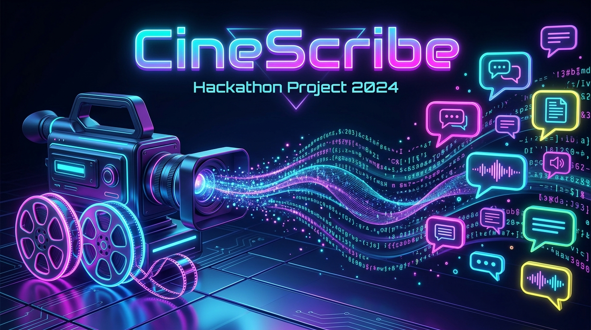

# CineScribe: High-Fidelity Style-Conditioned Video Captioning Agent



CineScribe is an advanced multi-modal video intelligence agent that extracts visual and audio event timelines from video clips and translates them into styled captions (Formal, Sarcastic, Humorous Tech, and Humorous Non-Tech) using serverless Fireworks AI models.

---

## Key Features

- **2-Stage Video Intelligence Pipeline**:
  1. **Visual-Audio Feature Extraction**: Segments videos, extracts key frames at scene midpoints, parses scenes using Kimi K2.6 VLM, and transcribes speech using Whisper.
  2. **Stylistic Translation**: Ingests chronological event sequences and synthesizes creative, tone-aligned captions using DeepSeek V4 Flash.
- **Robust Parsing & Fallbacks**: Resilient visual parser with automatic retry logic and fallback parameters.
- **Dockerized Compliance**: Reads input from `/input/tasks.json` and outputs results to `/output/results.json` matching the hackathon harness schema.

---

## Quick Start (Local Run)

### 1. Clone & Set Up Environment

Ensure you have Python 3.12+ installed. Clone the repository and install dependencies:

```bash
git clone https://github.com/urlsandcodes/cinescribe.git
cd cinescribe

# Create virtual environment
python -m venv .venv
source .venv/bin/activate

# Install package
pip install -e .
```

### 2. Configure Credentials

Copy the environment example file and fill in your Fireworks API credentials:

```bash
cp .env.example .env
```

Open `.env` and populate your `FIREWORKS_API_KEY`.

### 3. Run CineScribe CLI

Process a video directly from a remote URL or local path:

```bash
python -m app.main "https://storage.googleapis.com/amd-hackathon-clips/3044693-uhd_3840_2160_24fps.mp4"
```

To run tasks directly from a task list:
```bash
python -m app.main --tasks-path input/tasks.json --results-path output/results.json
```

---

## Running with Docker

CineScribe is fully containerized and compatible with `linux/amd64` target VMs.

### 1. Build the Docker Image
```bash
docker build -t cinescribe:latest .
```
*(If building on Apple Silicon, use `docker buildx build --platform linux/amd64 -t cinescribe:latest .`)*

### 2. Run Container with Mounted Volumes
Place your task specs in a local directory `input_test/tasks.json` and run:

```bash
docker run --rm \
  -v "$(pwd)/input_test:/input" \
  -v "$(pwd)/output_test:/output" \
  cinescribe:latest
```

The styled caption outputs will be written directly to `output_test/results.json` matching the submission schema.
